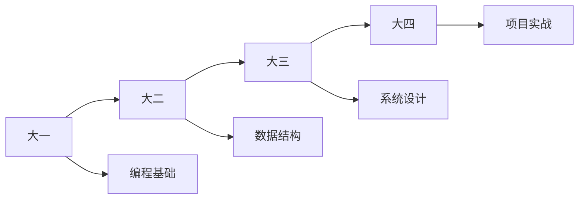

<!-- 动态横幅 -->

  

<!-- 个人介绍 -->

# 🚀 Li12668

🎓 **燕山大学 · 软件工程大一** | 💻 **C/C++ 开发者** | 🌱 **开源探索者**

## 🛠️ 技术栈 & 工具

### 💻 **编程语言**

### 🔧 **开发环境**

## 📊 GitHub 数据看板

<!-- GitHub统计卡片 -->

<!-- GitHub活动图表 -->

## 🎓 学术轨迹

📚 点击查看我的学习历程

### 🏫 燕山大学
- **学院**: 信息科学与工程学院（软件学院）
- **专业**: 软件工程
- **年级**: 大一
- **状态**: 🟢 在读

### 📖 当前课程
| 课程 | 进度 | 状态 |
|------|------|------|
| C语言程序设计 | ███░░░░░░░ | 🚧 学习中 |
| C++面向对象 | ███░░░░░░░ | 🚧 学习中 |
| 数据结构 | █░░░░░░░░░ | 📚 即将开始 |

## 🌟 特色项目

### 🚧 项目正在建设中...

<!-- 项目卡片 -->
| 🎯 学习笔记 | 🔬 实验代码 | 💡 开源贡献 |
|-------------|-------------|-------------|
| C/C++ 知识库 | 课程实验 | 社区项目 |
| 📝 持续更新 | 🔍 代码实践 | 🌱 计划中 |

## 📈 成长路线

🎯 近期目标
完善GitHub主页 - 进行中 ⏳

建立C++学习仓库 - 计划中 📅

参与开源项目 - 待开始 🔮

学习算法竞赛 - 待开始 🔮

## 📫 联系通道

<!-- 社交徽章 -->

 

<!-- 波浪分割线 -->

⭐ **感谢访问，期待与你交流编程的乐趣！** ⭐

<!-- 动态蛇动画 -->

